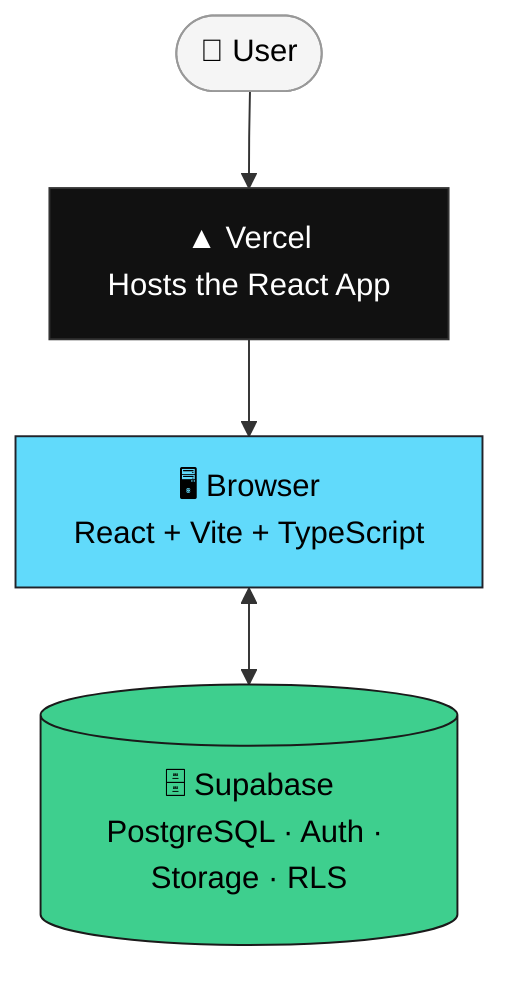
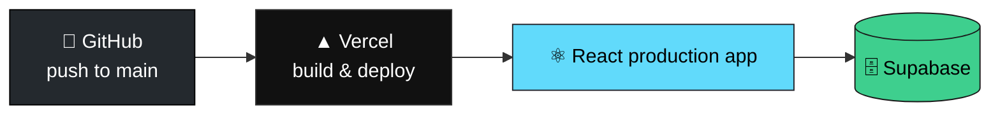
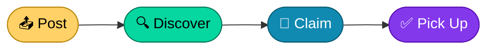

<div align="center">

# 🍱 Food Rescue

### Live surplus-food listings — connecting extra food with people nearby

*Reducing food waste through fast, local rescue — one listing at a time.*

[](https://react.dev)
[](https://www.typescriptlang.org)
[](https://vitejs.dev)
[](https://tailwindcss.com)
[](https://supabase.com)
[](https://vercel.com)
[](#-license)

<!-- 📸 Replace this line with a real demo screenshot or GIF before sharing this repo -->
<!-- 🔗 Replace the # below with your live Vercel URL -->
**[Live Demo](#)** · **[Report Bug](../../issues)** · **[Request Feature](../../issues)**

</div>

---

## 📚 Table of Contents

- [What is Food Rescue?](#-what-is-food-rescue)
- [Screenshots](#-screenshots)
- [Features](#-features)
- [Tech Stack](#-tech-stack)
- [Architecture](#-architecture)
- [Listing Lifecycle](#-listing-lifecycle)
- [Pickup Expiration](#-pickup-expiration)
- [Database Schema](#-database-schema)
- [Atomic Claiming](#-atomic-claiming)
- [Security](#-security)
- [Photo Upload](#-photo-upload)
- [My Listings](#-my-listings)
- [Project Structure](#-project-structure)
- [Getting Started](#-getting-started)
- [Supabase Setup](#-supabase-setup)
- [Deployment](#-deployment)
- [Testing](#-testing)
- [MVP Scope](#-mvp-scope)
- [Future Improvements](#-future-improvements)
- [Why Food Rescue?](#-why-food-rescue)
- [Contributing](#-contributing)
- [License](#-license)
- [Mission](#-mission)
- [Project Status](#-project-status)

---

## 🌱 What is Food Rescue?

Food Rescue is a full-stack app that helps restaurants, kitchens, stores, and individuals share surplus food before it goes to waste.

A user posts a listing with a pickup location, time window, quantity, description, and optional photo. Other authenticated users can view it and claim it.

> [!NOTE]
> **Lifecycle:** `Available → Claimed → Picked Up`
>
> Available listings automatically stop appearing in the active feed once their pickup window ends.

The project started as a rapid hackathon MVP and is now being hardened with stronger database security, expiration handling, ownership controls, and a more reliable claiming workflow.

---

## 📸 Screenshots

<!-- Add real screenshots or a short GIF of the claim flow (post → claim → picked up) here before you submit or share this repo.
For a hackathon README, this section gets more attention from judges/recruiters than any diagram below it. -->

| Available Feed | Claim Flow | My Listings |
|:---:|:---:|:---:|
| _screenshot_ | _screenshot_ | _screenshot_ |

---

## ✨ Features

### 🔐 Authentication
- Email/password authentication
- Signup, login, logout
- Authenticated-only application access
- User identity handled through Supabase Auth

### 🍱 Listings
- Create surplus-food listings
- Food name and description
- Quantity information
- Pickup area
- Pickup start and end time window
- Optional food photo upload
- Persistent PostgreSQL storage

### 🗂️ Listing Workflow
- Available / Claimed / Picked Up sections
- My Listings section
- Atomic food claiming
- Mark claimed food as picked up
- Pickup-window expiration handling
- Expired listings cannot be claimed
- Stale UI is protected against expired claims

### 👤 My Listings
Users can view the listings they personally posted — tracked independently from the global Available, Claimed, and Picked Up feeds.

### 🛡️ Security
- Supabase Row-Level Security
- Authenticated database access
- Users can only create listings for themselves
- Users cannot impersonate another user
- Claiming requires the listing to still be available
- Claiming requires the pickup window to still be active
- Only the claimant can mark food as picked up
- Users cannot freely modify other users' listings
- Database-level protection against stale and unauthorized updates

### 📸 Photos
- Optional food image upload
- Images stored in Supabase Storage
- Image URL stored in PostgreSQL
- Uploaded images displayed on listing cards

### ☁️ Infrastructure
- PostgreSQL database
- Supabase Authentication
- Supabase Storage
- Supabase Row-Level Security
- Vercel deployment
- GitHub source control
- Responsive React interface

---

## 🧱 Tech Stack


| Layer | Technology | Role |
|---|---|---|
| Frontend | React | Component-based UI |
| Build Tool | Vite | Dev server & bundler |
| Language | TypeScript | Static typing |
| Styling | Tailwind CSS v4 | Utility-first styling |
| Backend | Supabase | BaaS: DB, auth, storage |
| Database | PostgreSQL | Relational data store |
| Authentication | Supabase Auth | Email/password authentication |
| File Storage | Supabase Storage | Food photo uploads |
| Hosting | Vercel | Production hosting |
| Version Control | Git + GitHub | Source control |

---

## 🏗️ Architecture

Food Rescue does not require a separate Express, Node.js, or FastAPI backend — the React app talks to Supabase directly.



Supabase handles:
- Authentication
- PostgreSQL database
- Row-Level Security
- Storage
- Database-level authorization

---

## 📊 Listing Lifecycle

Every food listing follows a controlled lifecycle.


**Normal flow:** `Available → Claimed → Picked Up`

**Expiration flow:** `Available → pickup window ends → no longer claimable → removed from active feed`

> The database keeps the original `available` status rather than introducing a separate `expired` status — expiry is derived from `pickup_window_end`, not stored as its own state.

---

## ⏳ Pickup Expiration

A listing is considered expired when:

```
status = 'available' AND pickup_window_end <= now()
```

**Three layers of protection**, from least to most authoritative:

1. **UI** — the Claim button is hidden once `pickup_window_end` has passed; the user instead sees `⏰ Pickup window expired`.
2. **Client query** — the claim request itself filters on `pickup_window_end > now()` (exact query in [Atomic Claiming](#-atomic-claiming)).
3. **Database (RLS)** — the `UPDATE` policy independently re-checks `pickup_window_end > now()`, so an expired listing can't be claimed even via a stale tab or a direct API request.

```
UI hides Claim  →  Claim query filters on time  →  Supabase RLS re-checks time
   (convenience)         (client-side)                (actual authorization)
```

---

## 🗄️ Database Schema

```sql
create table public.listings (
  id uuid primary key default gen_random_uuid(),
  title text not null,
  description text,
  quantity text,
  photo_url text,
  location_text text not null,
  pickup_window_start timestamptz not null,
  pickup_window_end timestamptz not null,
  status text not null default 'available'
    check (status in ('available', 'claimed', 'picked_up')),
  posted_by uuid not null references auth.users(id),
  claimed_by uuid references auth.users(id),
  created_at timestamptz not null default now()
);

create index listings_status_created_idx
  on public.listings (status, created_at desc);
```

---

## ⚡ Atomic Claiming

The most important guarantee in Food Rescue: **two people can never claim the same food.**

The client only updates a listing when three conditions all still hold at the moment of the request:

```ts
const { data, error } = await supabase
  .from('listings')
  .update({
    status: 'claimed',
    claimed_by: currentUserId,
  })
  .eq('id', listing.id)
  .eq('status', 'available')
  .gt('pickup_window_end', new Date().toISOString())
  .select()
  .maybeSingle();
```

| Condition | Why it matters |
|---|---|
| `id = <listing>` | Targets the exact listing being claimed |
| `status = 'available'` | If another user claimed it first, this no longer matches — the update touches zero rows |
| `pickup_window_end > now()` | An expired listing can't be claimed even by a fast second request |

> [!IMPORTANT]
> This isn't just application logic — the same two conditions are enforced independently by the Supabase RLS `UPDATE` policy. The frontend gives immediate feedback; **the database is the actual authorization boundary.** If the two ever drift apart, the RLS policy wins — treat it as the source of truth.

---

## 🔒 Security

Supabase Row-Level Security (RLS) controls all database access — the frontend is never trusted as the authorization boundary.

- **SELECT** — authenticated users can view listings.
- **INSERT** — allowed only when `posted_by = auth.uid()`, preventing one user from posting on another's behalf.
- **UPDATE** — split by listing state:
  - Available listing: `status = 'available' AND pickup_window_end > now()`
  - Claimed listing: `status = 'claimed' AND claimed_by = auth.uid()`

Current guarantees:

- [x] Authenticated-only database access
- [x] Users can view listings
- [x] Users can create listings only for themselves
- [x] Users cannot impersonate another user on insert
- [x] Available listings can only be claimed while their pickup window is active
- [x] Expired listings cannot be claimed
- [x] A listing cannot be claimed twice
- [x] Only the claimant can mark a listing as picked up
- [x] Users cannot freely modify another user's listing

**Defense in depth:**

```
Frontend (hide expired Claim button)
   ↓
Claim query (filters on status + time)
   ↓
Supabase RLS (re-validates status + time)
   ↓
PostgreSQL (commits the update)
```

This protects against stale browser tabs, manipulated requests, and two users racing to claim the same listing.

---

## 📸 Photo Upload

Photos are optional and stored in a Supabase Storage bucket named `listing-photos`. Only the resulting URL is stored in Postgres — not the image itself.


---

## 📋 My Listings

A dedicated view filtering the existing `listings` table by `posted_by === userId` — no separate database table required. Lets contributors track food they personally posted, distinct from the global feeds.

---

## 📁 Project Structure

<details>
<summary>Click to expand</summary>

```
food-rescue/
├── public/
├── src/
│   ├── assets/
│   ├── components/
│   │   ├── Auth.tsx
│   │   ├── ListingCard.tsx
│   │   ├── ListingFeed.tsx
│   │   └── PostListingForm.tsx
│   ├── lib/
│   │   └── supabase.ts
│   ├── App.tsx
│   ├── App.css
│   ├── index.css
│   └── main.tsx
├── .env
├── .gitignore
├── index.html
├── package.json
├── package-lock.json
├── tsconfig.json
├── vite.config.ts
└── README.md
```

</details>

---

## 🚀 Getting Started

### Prerequisites
- Node.js 18+
- npm
- A free [Supabase](https://supabase.com) account

### 1. Clone the repository

```bash
git clone https://github.com/still-trying/food-rescue.git
cd food-rescue
```

### 2. Install dependencies

```bash
npm install
```

### 3. Configure environment variables

Create a `.env` file in the project root:

```
VITE_SUPABASE_URL=your_supabase_project_url
VITE_SUPABASE_ANON_KEY=your_supabase_anon_key
```

> [!WARNING]
> Never commit your `.env` file. Confirm `.gitignore` includes:
> ```
> .env
> .env.local
> ```

### 4. Run locally

```bash
npm run dev
```

The app runs at `http://localhost:5173`.

### 5. Production build

```bash
npm run build
npm run preview
```

---

## ⚙️ Supabase Setup

To reproduce the backend:

- [ ] Create a new Supabase project
- [ ] Run the schema from [Database Schema](#-database-schema)
- [ ] Enable Row-Level Security on the `listings` table
- [ ] Enable email/password authentication
- [ ] Create a Storage bucket named `listing-photos`
- [ ] Add Storage policies allowing authenticated uploads
- [ ] Add the listing `INSERT` policy
- [ ] Add the listing `SELECT` policy
- [ ] Add the listing `UPDATE` policy — must require `pickup_window_end > now()` on claim

---

## 🌐 Deployment

Hosted on Vercel, deployed on every push to `main`.



Set these in the Vercel project settings:
- `VITE_SUPABASE_URL`
- `VITE_SUPABASE_ANON_KEY`

---

## 🧪 Testing

**Authentication**
- [ ] Create account, login, logout
- [ ] Unauthenticated users cannot access the main application

**Listing Creation**
- [ ] Post surplus food with description, location, pickup window, optional photo
- [ ] Listing appears under Available

**Claiming**
- [ ] User A creates a listing; User B claims it and it moves to Claimed
- [ ] A second user cannot claim an already-claimed listing
- [ ] Only the claimant can mark it as Picked Up

**Expiration**
- [ ] A listing with a past pickup end time does not appear as active and hides the Claim button, showing `⏰ Pickup window expired`
- [ ] A claim attempted through a stale browser tab against an expired listing is rejected by the database

**Security**
- [ ] `INSERT` cannot use another user's `posted_by`
- [ ] An expired or already-claimed listing cannot be claimed
- [ ] A non-claimant cannot mark a listing as picked up
- [ ] Users cannot freely update another user's listing

**Photo Upload**
- [ ] Uploaded image appears on the Listing Card and in the `listing-photos` bucket, with `photo_url` stored on the listing

**My Listings**
- [ ] A user's own listing appears in My Listings; another user's listings do not

---

## 🎯 MVP Scope

Food Rescue intentionally focuses on the core food-rescue workflow.

<table>
<tr>
<td valign="top" width="50%">

**✅ Included**

- [x] Authentication (signup / login / logout)
- [x] Food listings — name, description, quantity
- [x] Pickup location, start & end time window
- [x] Food photos via Supabase Storage
- [x] Available / Claimed / Picked Up states
- [x] My Listings view
- [x] Atomic claiming
- [x] Pickup-window expiration handling
- [x] Frontend stale-expiration protection
- [x] Database-level expiration protection
- [x] Secure `UPDATE` authorization (RLS)
- [x] PostgreSQL persistence
- [x] Row-Level Security
- [x] Supabase Storage
- [x] Vercel deployment
- [x] Responsive interface

</td>
<td valign="top" width="50%">

**🔜 Not Included Yet**

- [ ] GPS-based discovery / maps
- [ ] Chat between poster and claimant
- [ ] Push notifications
- [ ] Ratings & reputation
- [ ] Payments
- [ ] Recommendation system
- [ ] Admin dashboard
- [ ] Real-time listing updates
- [ ] Business verification
- [ ] AI food classification
- [ ] Automated expired-listing cleanup
- [ ] User profiles
- [ ] Food categories
- [ ] Search & filtering

</td>
</tr>
</table>

---

## 🔮 Future Improvements

| Feature | Description |
|---|---|
| 📍 Location-based discovery | Show surplus food based on distance from the user |
| 🔎 Search & filtering | By food name, category, quantity, location, pickup time |
| 🗺️ Map integration | Display nearby food listings on a map |
| ⚡ Real-time updates | Supabase Realtime so listings update instantly when claimed |
| 🔔 Notifications | New food, claims, approaching/expiring pickup |
| 🏪 Business accounts | Verified accounts for restaurants, hotels, cafes, grocery stores |
| 📊 Impact dashboard | Meals rescued, pickups, waste prevented, contributors |
| ⭐ Community reputation | Ratings and reliability scores |
| 🛡️ Listing moderation | Reporting and moderation tools |
| 🧠 Smart matching | Recommend listings by distance, timing, food type |
| 👤 User profiles | Contributor and organization info |
| 🗂️ Food categories | Cooked meals, bakery items, groceries, etc. |
| ⏰ Automated expiration | Scheduled backend job to transition expired records |
| 📈 Analytics | Platform activity and food-waste reduction tracking |

---

## 💡 Why Food Rescue?

A large amount of edible food becomes waste simply because it becomes surplus before it can be consumed. Food Rescue's core idea: **make surplus food visible to people who can use it before it becomes waste.**

Instead of a complicated marketplace, the MVP is a simple local board:

```mermaid
flowchart LR
    A(["🍽️ Someone has extra food"]) --> B(["📤 Post it"])
    B --> C(["👀 Someone nearby sees it"])
    C --> D(["🤝 Claim it"])
    D --> E(["🚗 Pick it up"])
    E --> F(["♻️ Food is rescued"])

    style A fill:#FFD166,stroke:#b8860b,color:#000000
    style B fill:#FFD166,stroke:#b8860b,color:#000000
    style C fill:#06D6A0,stroke:#04795a,color:#000000
    style D fill:#06D6A0,stroke:#04795a,color:#000000
    style E fill:#118AB2,stroke:#0b5c73,color:#ffffff
    style F fill:#8338EC,stroke:#5b0fb3,color:#ffffff
```



---

## 🤝 Contributing

Contributions and improvements are welcome. For anything non-trivial, open an issue first to discuss the change.

```bash
git checkout -b feature/your-feature
git add .
git commit -m "Add your feature"
git push origin feature/your-feature
```

Then open a Pull Request on GitHub.

---

## 📄 License

MIT — see [`LICENSE`](./LICENSE).

> If there's no `LICENSE` file in the repo root yet, add one — GitHub can generate a standard MIT license file for you from the "Add file" menu, so the badge above actually points to something.

---

## 💚 Mission

<div align="center">

Food that can still be eaten should not become waste simply because it is surplus.

Food Rescue connects surplus food with people who can use it — quickly, locally, and simply.

</div>

---

## 🚧 Project Status

Food Rescue started as a rapid hackathon MVP and has moved from a basic functional prototype toward a more secure, production-oriented application.

**Current core workflow**



**Security and reliability improvements so far**

```
                    Food Rescue
                         │
        ┌────────────────┼────────────────┐
        ↓                ↓                ↓
   Authentication    RLS Security     Expiration
        │                │                │
        ↓                ↓                ↓
    User identity   Authorization     Pickup window
                         │                │
                         ↓                ↓
                  Secure updates    No stale claims
```

Implemented:
- [x] Authentication, food listings, food photos, pickup windows
- [x] Available / Claimed / Picked Up workflow + My Listings
- [x] Atomic claiming
- [x] Pickup expiration handling (frontend + database-level)
- [x] Secure `UPDATE` RLS policy, claimant-only pickup completion
- [x] Supabase Storage, PostgreSQL persistence, Vercel deployment

Next stage:
- [ ] Better location discovery, search & filtering
- [ ] Real-time updates, notifications
- [ ] Business accounts, trust & safety
- [ ] Impact tracking, community features
- [ ] Automated expiration workflows

<div align="center">

🔗 [github.com/still-trying/food-rescue](https://github.com/still-trying/food-rescue)

Made with 🍱 + ☕ — if this is useful, a ⭐ helps.

</div> 
