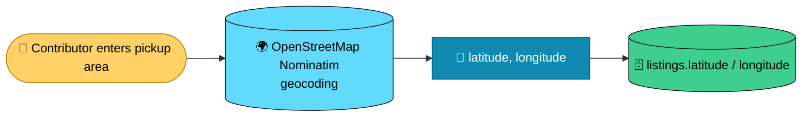
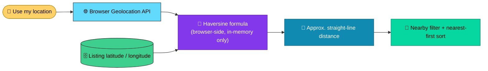
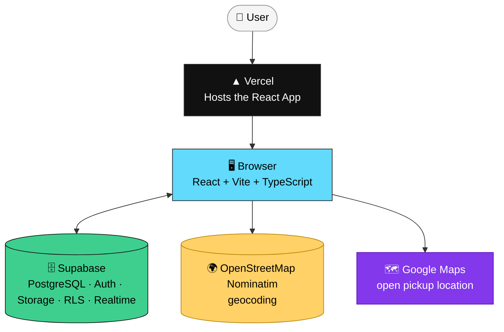
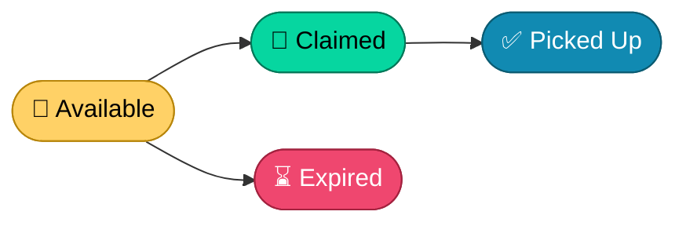
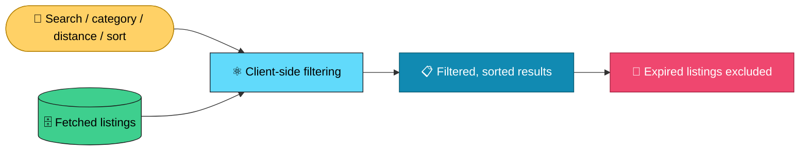
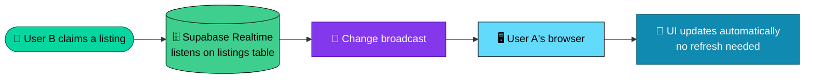
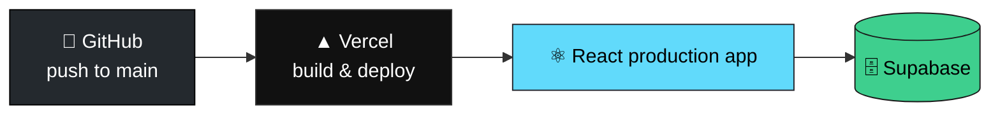
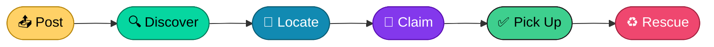

<div align="center">

# 🍱 Food Rescue

### Live surplus-food listings — connecting extra food with people nearby

*Reducing food waste through fast, local rescue — one listing at a time.*

[](https://react.dev)
[](https://www.typescriptlang.org)
[](https://vitejs.dev)
[](https://tailwindcss.com)
[](https://supabase.com)
[](https://www.postgresql.org)
[](https://vercel.com)
[](#-license)

<!-- Replace # with the actual deployed URL before public sharing -->
**[Live Demo](#)** · **[Report Bug](../../issues)** · **[Request Feature](../../issues)**

</div>

---

## 📚 Table of Contents

- [What is Food Rescue?](#-what-is-food-rescue)
- [Screenshots](#-screenshots)
- [Features](#-features)
- [Location-Aware Discovery](#-location-aware-discovery)
- [Tech Stack](#-tech-stack)
- [Architecture](#-architecture)
- [Listing Lifecycle](#-listing-lifecycle)
- [Pickup Expiration](#-pickup-expiration)
- [Search, Categories & Filtering](#-search-categories--filtering)
- [Database Schema](#-database-schema)
- [Atomic Claiming](#-atomic-claiming)
- [Security](#-security)
- [Photo Upload](#-photo-upload)
- [My Listings](#-my-listings)
- [Realtime Updates](#-realtime-updates)
- [Project Structure](#-project-structure)
- [Getting Started](#-getting-started)
- [Supabase Setup](#-supabase-setup)
- [Deployment](#-deployment)
- [Testing](#-testing)
- [MVP Scope](#-mvp-scope)
- [Future Improvements](#-future-improvements)
- [Why Food Rescue?](#-why-food-rescue)
- [Contributing](#-contributing)
- [License](#-license)
- [Mission](#-mission)
- [Project Status](#-project-status)

---

## 🌱 What is Food Rescue?

Food Rescue is a full-stack application that helps restaurants, kitchens, stores, organizations, and individuals share surplus food before it goes to waste.

A contributor can create a listing with:

- Food name, description, quantity, category
- Pickup area and time window
- Optional food photo
- Geocoded latitude and longitude

Authenticated users can discover, search, filter, sort, locate, and claim available food.

> [!NOTE]
> **Lifecycle:** `Available → Claimed → Picked Up`
>
> Available listings automatically stop appearing in the active feed once their pickup window ends.

The project started as a rapid hackathon MVP and has evolved into a more complete, production-oriented application with stronger database security, expiration protection, structured food categories, search and filtering, realtime synchronization, and location-aware discovery.

---

## 📸 Screenshots

<!-- Add real screenshots or a short GIF before public sharing -->

| Available Feed | Search & Filters | Location Discovery | My Listings |
|:---:|:---:|:---:|:---:|
| _screenshot_ | _screenshot_ | _screenshot_ | _screenshot_ |

---

## ✨ Features

### 🔐 Authentication
- Email/password authentication
- Signup, login, logout
- Authenticated-only application access
- Signup supports optional user metadata such as name
- User identity handled through Supabase Auth

### 🍱 Listings
- Food name, description, quantity, category
- Pickup area and start/end time window
- Optional food photo
- Geocoded latitude and longitude
- Persistent PostgreSQL storage

### 🗂️ Listing Workflow
- Available / Claimed / Picked Up sections
- My Listings section
- Atomic food claiming, claimant-only pickup completion
- Pickup-window expiration handling
- Expired listings disappear from the active feed and cannot be claimed
- Stale browser tabs are protected against invalid claims
- Loading, error, and retry-safe UI states

### 🗃️ Food Categories
Listings can be categorized as 🍛 Cooked Meals, 🥖 Bakery, 🛒 Groceries, 🥦 Fruits & Vegetables, 🥤 Beverages, or 🍱 Other — stored in PostgreSQL and validated with a database-level `CHECK` constraint. Full mapping in [Search, Categories & Filtering](#-search-categories--filtering).

### 🔎 Search & Discovery
- Search by food name, description, or pickup location
- Filter by category and by distance
- Sort by newest, pickup ending soonest, or nearest
- Combine search, category, distance, and sorting together
- Expired listings are excluded; result counts update live; one-click clear-all-filters

### 📍 Location-Aware Discovery
- Every listing can store geocoded latitude/longitude alongside its pickup area
- Users can opt in to browser location for distance-based discovery
- Approximate straight-line distance shown per listing (Haversine formula)
- Filter by distance (1 km / 5 km / 10 km) and sort nearest-first
- One-tap **Open in Maps** for listings with valid coordinates

Full detail in [Location-Aware Discovery](#-location-aware-discovery).

### 👤 My Listings
Users can view the listings they personally posted — tracked independently from the global feeds, filtered by their own user ID.

### ⚡ Realtime Updates
- Listing changes sync through Supabase Realtime (`INSERT`, `UPDATE`, `DELETE`)
- New listings, claims, and picked-up state changes propagate without a manual refresh
- Keeps the live food board synchronized between everyone viewing it

### 🛡️ Security
- Supabase Row-Level Security; authenticated-only database access
- Users can only create listings for themselves and cannot impersonate another user
- Claiming requires the listing to still be available and its pickup window still active
- Only the claimant can mark food as picked up
- Users cannot freely modify another user's listing
- Category, latitude, and longitude values are validated at the database level
- Storage uploads are restricted by Storage policies

### 📸 Photos
- Optional food image upload — JPG, PNG, or WebP, with size validation
- Images stored in Supabase Storage, URL stored in PostgreSQL
- Failed listing creation triggers cleanup of an already-uploaded image
- Uploaded images displayed on listing cards

### ☁️ Infrastructure
- PostgreSQL database
- Supabase Authentication, Storage, Row-Level Security, Realtime
- Browser Geolocation API
- OpenStreetMap Nominatim geocoding
- Google Maps links for pickup points
- Vercel deployment
- GitHub source control
- Responsive React interface

---

## 📍 Location-Aware Discovery

A dedicated discovery layer on top of the core food-rescue workflow: every listing can carry coordinates, and users can opt in to their own location to see distance and filter by proximity.

### Listing coordinates

The pickup area entered by a contributor is geocoded into coordinates at creation time, so each listing can store both a human-readable location and machine-readable coordinates:

```text
location_text: "Vikas Nagar, Lucknow"
latitude:      26.894244
longitude:     80.964068
```



### User location & distance

Users explicitly opt in with **📍 Use my location** — nothing is requested automatically. The browser's coordinates stay in local React state for distance calculations and are **never written to the `listings` table or any other database record.**

Distance to each listing is computed client-side with the Haversine formula and shown as an approximate straight-line distance, e.g. `📏 850 m away · straight-line` or `📏 2.4 km away · straight-line`.



> Displayed distance is **straight-line, not driving distance**, and is labeled as such. For example, PSIT Kanpur → Vikas Nagar, Lucknow shows as ≈ 91 km straight-line in Food Rescue, versus ≈ 124–129 km driving on Google Maps — road routes aren't straight lines, so the two numbers will legitimately differ.

### Nearby filtering & sorting
- Filter by **Any distance**, **Within 1 km**, **Within 5 km**, or **Within 10 km** (enabled only once location is on)
- Sort by nearest-first
- Listings without coordinates stay visible in the general feed but are excluded from distance filtering/sorting — never given a fabricated distance

### Location UX
- Enable, update, and clear location on demand
- Permission-denial and unsupported-browser states are handled explicitly
- Distance filters are disabled until location is enabled
- Clearing search filters doesn't revoke location permission

### Open in Maps
Listings with valid coordinates show a **🗺️ Open in Maps** button linking to Google Maps, completing the path:

`Discover → See distance → Choose food → Open pickup point → Navigate`

---

## 🧱 Tech Stack


| Layer | Technology | Role |
|---|---|---|
| Frontend | React | Component-based UI |
| Build Tool | Vite | Dev server & bundler |
| Language | TypeScript | Static typing |
| Styling | Tailwind CSS v4 | Utility-first styling |
| Backend | Supabase | BaaS: DB, auth, storage, realtime |
| Database | PostgreSQL | Relational data store |
| Authentication | Supabase Auth | Email/password authentication |
| File Storage | Supabase Storage | Food photo uploads |
| Realtime | Supabase Realtime | Live database change updates |
| Geolocation | Browser Geolocation API | User location access |
| Geocoding | OpenStreetMap Nominatim | Pickup-area → coordinates |
| Mapping | Google Maps links | Open listing pickup location |
| Hosting | Vercel | Production hosting |
| Version Control | Git + GitHub | Source control |

---

## 🏗️ Architecture

Food Rescue does not require a separate Express, Node.js, or FastAPI backend — the React app talks to Supabase, and to two external location services, directly.



**Supabase handles:** authentication, the PostgreSQL database, Row-Level Security, storage, realtime database events, and database-level authorization.

**The browser handles:** rendering, search and filtering, local distance calculation, browser geolocation, location controls, and opening map links.

---

## 📊 Listing Lifecycle

Every food listing follows a controlled lifecycle.



**Normal flow:** `Available → Claimed → Picked Up`

**Expiration flow:** `Available → pickup window ends → no longer claimable → removed from active feed`

> The database keeps the original `available` status rather than introducing a separate `expired` status — expiry is derived from `pickup_window_end`.

---

## ⏳ Pickup Expiration

A listing is considered expired when:

```
status = 'available' AND pickup_window_end <= now()
```

**Three layers of protection**, from least to most authoritative:

1. **UI** — the Claim button disappears once `pickup_window_end` has passed; the user sees `⏰ Pickup window expired`.
2. **Client query** — the claim request itself checks that the pickup window is still active:

```ts
const { data, error } = await supabase
  .from('listings')
  .update({
    status: 'claimed',
    claimed_by: currentUserId,
  })
  .eq('id', listing.id)
  .eq('status', 'available')
  .gt('pickup_window_end', new Date().toISOString())
  .select()
  .maybeSingle();
```

3. **Database (RLS)** — Supabase independently re-checks authorization and the pickup-window condition, so an expired listing can't be claimed via a stale tab or direct API request.

```
UI hides Claim  →  Claim query checks time  →  Supabase RLS checks time again  →  PostgreSQL commits only an authorized update
```

---

## 🔎 Search, Categories & Filtering

Food Rescue provides a **client-side** discovery layer over the fetched listing feed. Users can:

- Search by food title, description, or pickup location
- Filter by category and by distance
- Sort by newest, pickup ending soonest, or nearest
- Clear filters, and combine multiple filters at once

**Supported categories**

| Category | Stored value |
|---|---|
| 🍛 Cooked Meals | `cooked_meals` |
| 🥖 Bakery | `bakery` |
| 🛒 Groceries | `groceries` |
| 🥦 Fruits & Vegetables | `fruits_vegetables` |
| 🥤 Beverages | `beverages` |
| 🍱 Other | `other` |

**Distance filters** (enabled only once location is on)

| Filter | Behavior |
|---|---|
| Any distance | Shows all eligible listings |
| Within 1 km | Distance ≤ 1 km |
| Within 5 km | Distance ≤ 5 km |
| Within 10 km | Distance ≤ 10 km |



---

## 🗄️ Database Schema

```sql
create table public.listings (
  id uuid primary key default gen_random_uuid(),
  title text not null,
  description text,
  quantity text,
  category text,
  photo_url text,

  location_text text not null,
  latitude numeric(9,6),
  longitude numeric(9,6),

  pickup_window_start timestamptz not null,
  pickup_window_end timestamptz not null,

  status text not null default 'available'
    check (status in ('available', 'claimed', 'picked_up')),

  posted_by uuid not null references auth.users(id),
  claimed_by uuid references auth.users(id),

  created_at timestamptz not null default now()
);

create index listings_status_created_idx
  on public.listings (status, created_at desc);
```

**Validation constraints**

```sql
alter table public.listings
add constraint listings_category_check
check (
  category is null
  or category in (
    'cooked_meals', 'bakery', 'groceries',
    'fruits_vegetables', 'beverages', 'other'
  )
);

alter table public.listings
add constraint listings_latitude_check
check (latitude is null or (latitude >= -90 and latitude <= 90));

alter table public.listings
add constraint listings_longitude_check
check (longitude is null or (longitude >= -180 and longitude <= 180));
```

**Existing listing compatibility** — `latitude`/`longitude` are nullable so listings created before location support still work. Legacy rows with `NULL` coordinates remain visible in the normal feed but can't participate in distance filtering or distance display until coordinates are backfilled.

---

## ⚡ Atomic Claiming

The most important guarantee in Food Rescue: **two users cannot successfully claim the same listing through the supported claim flow.**

The client only updates a listing when all conditions still hold at the moment of the request:

```ts
const { data, error } = await supabase
  .from('listings')
  .update({
    status: 'claimed',
    claimed_by: currentUserId,
  })
  .eq('id', listing.id)
  .eq('status', 'available')
  .gt('pickup_window_end', new Date().toISOString())
  .select()
  .maybeSingle();
```

| Condition | Why it matters |
|---|---|
| `id = <listing>` | Targets the exact listing |
| `status = 'available'` | Prevents an already-claimed listing from being claimed again |
| `pickup_window_end > now()` | Prevents an expired listing from being claimed |

If the listing changed before the update runs, it matches zero rows and the UI reports the food is no longer available.

> [!IMPORTANT]
> The frontend is not the authorization boundary — Supabase RLS independently re-checks and enforces the same conditions at the database level. If the two ever drift apart, the RLS policy wins.

---

## 🔒 Security

Supabase Row-Level Security controls access to the `listings` table.

- **SELECT** — authenticated users can view listings.
- **INSERT** — allowed only when `posted_by = auth.uid()`.
- **UPDATE** — state-based: claiming requires an active, available listing; pickup completion requires being the claimant.

Current guarantees:

- [x] Authenticated-only database access
- [x] Users can view listings
- [x] Users can create listings only for themselves
- [x] Users cannot impersonate another user on insert
- [x] Available listings can only be claimed while their pickup window is active
- [x] Expired listings cannot be claimed
- [x] A listing cannot be claimed twice
- [x] Only the claimant can mark a listing as picked up
- [x] Users cannot freely modify another user's listing
- [x] Category values are validated by PostgreSQL
- [x] Latitude values are range-validated
- [x] Longitude values are range-validated
- [x] Storage uploads are restricted by Supabase Storage policies

**Defense in depth:**

```
Frontend (hide expired Claim button)
   ↓
Claim query (filters on status + time)
   ↓
Supabase RLS (re-validates status + time)
   ↓
PostgreSQL (commits the update)
```

This is designed to remain safe even when the client is stale or manipulated.

---

## 📸 Photo Upload

Photos are optional and stored in a Supabase Storage bucket named `listing-photos`. Only the resulting URL is stored in Postgres — not the image itself.

- Supported types: JPG, PNG, WebP
- Maximum file size: 5 MB
- If an image uploads successfully but the listing itself fails to be created, the orphaned image is cleaned up


---

## 📋 My Listings

A dedicated view filters the existing `listings` table by `posted_by === currentUserId` — no separate database table required:

`🌎 Global listings → 👤 My Listings`

---

## ⚡ Realtime Updates

Food Rescue listens for `INSERT`, `UPDATE`, and `DELETE` changes on the `listings` table via Supabase Realtime, so multiple users viewing the same board stay in sync without a manual refresh.



---

## 📁 Project Structure

<details>
<summary>Click to expand</summary>

```
food-rescue/
├── public/
├── src/
│   ├── assets/
│   ├── components/
│   │   ├── Auth.tsx
│   │   ├── ListingCard.tsx
│   │   ├── ListingFeed.tsx
│   │   └── PostListingForm.tsx
│   ├── lib/
│   │   └── supabase.ts
│   ├── App.tsx
│   ├── App.css
│   ├── index.css
│   └── main.tsx
├── .env
├── .gitignore
├── index.html
├── package.json
├── package-lock.json
├── tsconfig.json
├── vite.config.ts
└── README.md
```

</details>

---

## 🚀 Getting Started

### Prerequisites
- Node.js 18+
- npm
- A free [Supabase](https://supabase.com) account

### 1. Clone the repository

```bash
git clone https://github.com/still-trying/food-rescue.git
cd food-rescue
```

### 2. Install dependencies

```bash
npm install
```

### 3. Configure environment variables

Create a `.env` file in the project root:

```
VITE_SUPABASE_URL=your_supabase_project_url
VITE_SUPABASE_ANON_KEY=your_supabase_anon_key
```

> [!WARNING]
> Never commit your `.env` file. Confirm `.gitignore` includes:
> ```
> .env
> .env.local
> ```

### 4. Run locally

```bash
npm run dev
```

The app runs at `http://localhost:5173`.

### 5. Production build

```bash
npm run build
npm run preview
```

---

## ⚙️ Supabase Setup

To reproduce the backend:

- [ ] Create a new Supabase project
- [ ] Run the `listings` table schema from [Database Schema](#-database-schema)
- [ ] Add the `category` column and its validation constraint
- [ ] Add `latitude` / `longitude` columns and their range-validation constraints
- [ ] Enable Row-Level Security on `listings`
- [ ] Enable email/password authentication
- [ ] Configure email confirmation settings as appropriate for the environment
- [ ] Create a Storage bucket named `listing-photos`
- [ ] Add Storage policies for authenticated uploads
- [ ] Add the listing `INSERT`, `SELECT`, and `UPDATE` policies
- [ ] Confirm the `UPDATE` policy protects active pickup windows
- [ ] Enable Supabase Realtime on the `listings` table
- [ ] Verify location columns and constraints

---

## 🌐 Deployment

Hosted on Vercel, deployed on every push to `main`.



Set these in the Vercel project settings:
- `VITE_SUPABASE_URL`
- `VITE_SUPABASE_ANON_KEY`

The deployed app also relies on browser-side geolocation and the external Nominatim/Google Maps services for location-aware functionality — no extra Vercel config needed for those.

---

## 🧪 Testing

**Authentication**
- [ ] Create account, login, logout
- [ ] Unauthenticated users cannot access the main application
- [ ] Existing-account signup behavior remains safe

**Listing Creation**
- [ ] Description, quantity, category, pickup area, and pickup start/end validation all work
- [ ] Optional photo works
- [ ] Listing appears under Available

**Search & Filtering**
- [ ] Search by name, description, location
- [ ] Filter by category; sort by newest / pickup-soonest
- [ ] Search + category + distance combine correctly
- [ ] Clear filters works; expired listings are excluded

**Location**
- [ ] New listings receive latitude/longitude; existing listings without coordinates still work
- [ ] Location is never requested automatically — only on explicit "Use my location"
- [ ] Permission denial and unsupported-geolocation are handled correctly
- [ ] Update and clear location both work
- [ ] Distance values display correctly and are labeled straight-line
- [ ] Within 1/5/10 km and Any distance all work; nearest-first works
- [ ] Listings without coordinates never show a fabricated distance
- [ ] Open in Maps opens the correct coordinates; listings without coordinates don't show the action

**Claiming**
- [ ] User A creates a listing; User B claims it and it moves to Claimed
- [ ] A second user cannot claim an already-claimed listing
- [ ] Only the claimant can mark it as Picked Up

**Expiration**
- [ ] An expired listing is removed from the active feed and hides the Claim button, showing `⏰ Pickup window expired`
- [ ] A stale browser tab can't claim an expired listing; the database independently rejects it

**Security**
- [ ] `INSERT` cannot use another user's `posted_by`
- [ ] Expired or already-claimed listings can't be claimed; only the claimant can mark picked-up
- [ ] Users cannot freely update another user's listing
- [ ] Invalid category, latitude, and longitude values are all rejected by PostgreSQL
- [ ] Storage upload policies reject unauthorized uploads

**Photo Upload**
- [ ] Valid JPG/PNG/WebP uploads succeed; oversized or unsupported types are rejected
- [ ] Uploaded photo appears on the Listing Card and `photo_url` is stored correctly
- [ ] Failed listing creation cleans up an already-uploaded image when possible

**My Listings**
- [ ] A user's own listing appears in My Listings; another user's listings do not

**Realtime**
- [ ] New listings, claims, and picked-up changes appear without a refresh
- [ ] Deleted listings disappear without a refresh

---

## 🎯 MVP Scope

Food Rescue intentionally focuses on the core surplus-food rescue workflow while continuing to evolve beyond the original rapid MVP.

**✅ Implemented**

- [x] Authentication (signup / login / logout)
- [x] Food listings — name, description, quantity, category
- [x] Category database validation
- [x] Pickup location, start & end time
- [x] Optional food photos via Supabase Storage
- [x] Available / Claimed / Picked Up states, My Listings
- [x] Atomic claiming, claimant-only pickup completion
- [x] Pickup-window expiration handling, secure `UPDATE` RLS policy
- [x] Search, category filtering, distance filtering
- [x] Newest / pickup-soonest / nearest-first sorting
- [x] Browser geolocation, listing geocoding, lat/lon storage
- [x] Straight-line distance calculation and location UX controls
- [x] Open pickup location in Maps
- [x] Realtime listing updates
- [x] PostgreSQL persistence, Row-Level Security
- [x] Vercel deployment, GitHub source control
- [x] Responsive interface, error and loading states

**🔜 Not Included Yet**

- [ ] Turn-by-turn navigation inside the application
- [ ] Embedded interactive map view
- [ ] Push notifications
- [ ] Chat between poster and claimant
- [ ] Ratings & reputation
- [ ] Payments
- [ ] Recommendation / smart matching system
- [ ] Admin dashboard
- [ ] Business verification
- [ ] AI food classification
- [ ] Automated expired-listing cleanup
- [ ] User profiles
- [ ] Impact dashboard
- [ ] Advanced moderation / community reporting
- [ ] Delivery / logistics support

---

## 🔮 Future Improvements

| Feature | Description |
|---|---|
| 🗺️ Interactive map | Show available food listings on a visual map |
| 🚗 Directions experience | Improve the path from user location to pickup point |
| 🔔 Push notifications | Nearby food, claim events, and pickup reminders |
| 🏪 Business accounts | Verified restaurants, hotels, cafes, stores, organizations |
| 📊 Impact dashboard | Meals rescued, pickups completed, waste prevented, contributors |
| ⭐ Community reputation | Reliability and contribution scores |
| 🛡️ Listing moderation | Reporting and moderation workflow |
| 🧠 Smart matching | Recommend listings by distance, timing, and food type |
| 👤 User profiles | Contributor and organization information |
| ⏰ Automated expiration | Scheduled backend cleanup or state transitions |
| 📈 Analytics | Platform usage and food-waste reduction metrics |
| 💬 Messaging | Direct poster ↔ claimant communication |
| 🚚 Logistics | Optional delivery or pickup coordination |
| 🧭 Advanced location search | Better neighborhood and map-based discovery |
| 📍 Better geocoding architecture | Move high-volume geocoding behind a controlled backend/provider |

---

## 💡 Why Food Rescue?

A large amount of edible food becomes waste simply because it becomes surplus before it can be consumed. Food Rescue's core idea: **make surplus food visible to people who can use it before it becomes waste.**

Instead of a complicated marketplace, the application focuses on a direct local workflow:


---

## 🤝 Contributing

Contributions and improvements are welcome. For anything non-trivial, open an issue first to discuss the change.

```bash
git checkout -b feature/your-feature
git add .
git commit -m "Add your feature"
git push origin feature/your-feature
```

Then open a Pull Request on GitHub.

---

## 📄 License

MIT — see [`LICENSE`](./LICENSE).

> If there's no `LICENSE` file in the repo root yet, add one — GitHub can generate a standard MIT license file from the "Add file" menu, so the badge above and the repo's actual licensing stay consistent.

---

## 💚 Mission

<div align="center">

Food that can still be eaten should not become waste simply because it is surplus.

Food Rescue connects surplus food with people who can use it — quickly, locally, and simply.

**Post → Discover → Locate → Claim → Pick Up → Rescue**

</div>

---

## 🚧 Project Status

Food Rescue started as a rapid hackathon MVP and has evolved into a more complete, secure, location-aware application.

**Current core workflow**



Implemented:
- [x] Authentication, food listings, food photos, pickup windows
- [x] Food categories with database validation
- [x] Search, category filtering, distance filtering, listing sorting
- [x] My Listings, atomic claiming, claimant-only pickup completion
- [x] Pickup expiration handling, secure `UPDATE` RLS policy
- [x] Supabase Realtime, Supabase Storage
- [x] Latitude/longitude support, geocoding, browser location support
- [x] Haversine straight-line distance, nearest-first discovery, open-in-Maps
- [x] PostgreSQL persistence, Vercel deployment

Next development stage:
- [ ] Improve map and navigation experience
- [ ] Notification infrastructure
- [ ] Business / organization accounts, trust & safety systems
- [ ] User profiles, impact tracking
- [ ] Automated expiration workflows
- [ ] Messaging and community features
- [ ] Smarter food discovery and matching

<div align="center">

🔗 [github.com/still-trying/food-rescue](https://github.com/still-trying/food-rescue)

Made with 🍱 + ☕ — if this is useful, a ⭐ helps.

</div>
