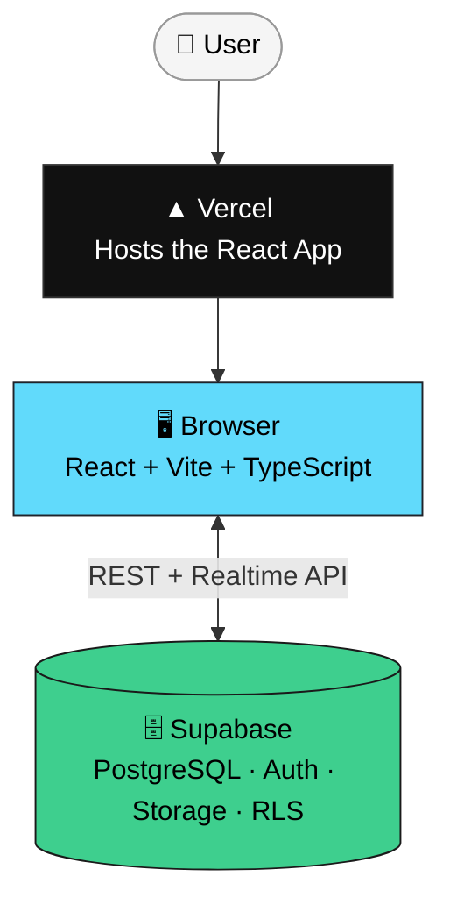
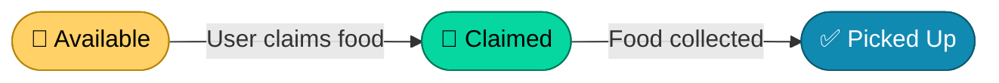
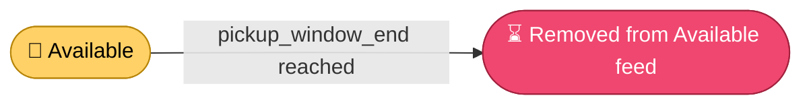
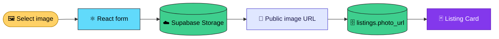
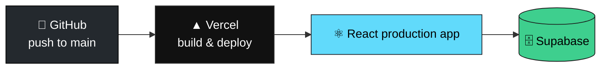

<div align="center">

# 🍱 Food Rescue

### Live surplus-food listings — connecting extra food with people nearby

*Reducing food waste through fast, local rescue — one listing at a time.*

[](https://react.dev)
[](https://www.typescriptlang.org)
[](https://vitejs.dev)
[](https://tailwindcss.com)
[](https://supabase.com)
[](https://vercel.com)
[](#-license)

<!-- 📸 Add a demo screenshot or GIF here — this is the single biggest visual upgrade you can make for judging -->
<!-- 🔗 Add your live Vercel demo link here once deployed -->

</div>

---

## 📚 Table of Contents

- [What is Food Rescue?](#-what-is-food-rescue)
- [Features](#-features)
- [Tech Stack](#-tech-stack)
- [Architecture](#-architecture)
- [Listing Lifecycle](#-listing-lifecycle)
- [Pickup Expiration](#-pickup-expiration)
- [Database Schema](#-database-schema)
- [Atomic Claiming](#-atomic-claiming)
- [Security](#-security)
- [Photo Upload](#-photo-upload)
- [My Listings](#-my-listings)
- [Project Structure](#-project-structure)
- [Getting Started](#-getting-started)
- [Supabase Setup](#-supabase-setup)
- [Deployment](#-deployment)
- [Testing](#-testing)
- [MVP Scope](#-mvp-scope)
- [Future Improvements](#-future-improvements)
- [Why Food Rescue?](#-why-food-rescue)
- [Contributing](#-contributing)
- [License](#-license)
- [Mission](#-mission)
- [Project Status](#-project-status)

---

## 🌱 What is Food Rescue?

Food Rescue is a full-stack MVP that helps restaurants, kitchens, stores, and individuals share surplus food before it goes to waste.

A user posts an available food listing with a pickup location, time window, quantity, description, and optional photo. Other authenticated users can view the listing and claim it.

> [!NOTE]
> **Lifecycle:** `Available → Claimed → Picked Up`
> Listings whose pickup window has ended are automatically removed from the active Available feed.

The project focuses on making the core food-rescue workflow simple, fast, and reliable.

---

## ✨ Features

**🔐 Authentication**
- Email/password authentication
- User signup with name

**🍱 Listings**
- Create surplus-food listings
- Food name and description
- Quantity information
- Pickup area
- Pickup start and end time window
- Optional food photo upload

**🗂️ Workflow**
- Available / Claimed / Picked Up sections
- My Listings view
- ⚡ Atomic food claiming — no double-claims possible
- Mark claimed food as picked up
- Pickup-window expiration handling

**☁️ Infrastructure**
- Persistent PostgreSQL storage
- Row-Level Security with Supabase
- Supabase Storage for food photos
- Vercel deployment
- Responsive interface

---

## 🧱 Tech Stack


| Layer | Technology | Role |
|---|---|---|
| Frontend | React | Component-based UI |
| Build Tool | Vite | Dev server & bundler |
| Language | TypeScript | Static typing |
| Styling | Tailwind CSS v4 | Utility-first styling |
| Backend | Supabase | BaaS: DB, auth, storage |
| Database | PostgreSQL | Relational data store |
| Authentication | Supabase Auth | Email/password auth |
| File Storage | Supabase Storage | Food photo uploads |
| Hosting | Vercel | Production hosting |
| Version Control | Git + GitHub | Source control |

---

## 🏗️ Architecture

Food Rescue does not require a separate Express, Node.js, or FastAPI backend. The React application communicates directly with Supabase.



---

## 📊 Listing Lifecycle

Every food listing follows this lifecycle. Each listing carries a pickup window so users know when the food can be collected.



---

## ⏳ Pickup Expiration

The application uses the existing `pickup_window_end` field to determine whether an available listing has expired.



> [!NOTE]
> The database does not currently use a separate `expired` status. This keeps the lifecycle simple while preventing expired available food from remaining claimable.

---

## 🗄️ Database Schema

The core application uses a PostgreSQL `listings` table in Supabase.

```sql
create table public.listings (
  id uuid primary key default gen_random_uuid(),

  title text not null,

  description text,

  quantity text,

  photo_url text,

  location_text text not null,

  pickup_window_start timestamptz not null,

  pickup_window_end timestamptz not null,

  status text not null default 'available'
    check (
      status in (
        'available',
        'claimed',
        'picked_up'
      )
    ),

  posted_by uuid not null
    references auth.users(id),

  claimed_by uuid
    references auth.users(id),

  created_at timestamptz not null
    default now()
);
```

An index is used to efficiently retrieve listings:

```sql
create index listings_status_created_idx
on public.listings (
  status,
  created_at desc
);
```

---

## ⚡ Atomic Claiming

One of the most important parts of Food Rescue is preventing two people from claiming the same food. The application only allows a listing to be updated if its current status is `available`.

```typescript
const { data, error } = await supabase
  .from('listings')
  .update({
    status: 'claimed',
    claimed_by: user.id,
  })
  .eq('id', listingId)
  .eq('status', 'available')
  .select()
  .maybeSingle()
```

> [!IMPORTANT]
> The critical condition is `.eq('status', 'available')`. If another user has already claimed the listing, this update matches zero rows — the second request cannot overwrite the existing claim. This provides database-level protection against double claiming.

---

## 🔒 Security

Supabase Row-Level Security (RLS) controls database access. The policies guarantee:

- [x] Authenticated users can view food listings
- [x] Users can create listings for themselves
- [x] Users cannot impersonate another user when creating a listing
- [x] Users can claim available food
- [x] A listing cannot be claimed twice
- [x] Only the user who claimed food can mark it as picked up
- [x] Users cannot freely modify other users' listings

Authentication is handled through Supabase Auth.

---

## 📸 Photo Upload

Food Rescue supports optional food photos, stored in a Supabase Storage bucket named `listing-photos`. Only the image URL is stored in the listing record — the photo itself lives in Storage, not in PostgreSQL.



---

## 📋 My Listings

Food Rescue includes a My Listings view. Users can see listings they personally posted and track their current status:

  

This gives contributors a simple way to track the food they've shared.

---

## 📁 Project Structure

<details>
<summary>Click to expand</summary>

```text
food-rescue/
│
├── public/
│
├── src/
│   ├── assets/
│   │
│   ├── components/
│   │   ├── Auth.tsx
│   │   ├── ListingCard.tsx
│   │   ├── ListingFeed.tsx
│   │   └── PostListingForm.tsx
│   │
│   ├── lib/
│   │   └── supabase.ts
│   │
│   ├── App.tsx
│   ├── App.css
│   ├── index.css
│   └── main.tsx
│
├── .env
├── .gitignore
├── index.html
├── package.json
├── package-lock.json
├── tsconfig.json
├── vite.config.ts
└── README.md
```

</details>

---

## 🚀 Getting Started

**Prerequisites:** Node.js 18+, npm, and a free [Supabase](https://supabase.com) account.

#### 1. Clone the repository

```bash
git clone https://github.com/still-trying/food-rescue.git
cd food-rescue
```

#### 2. Install dependencies

```bash
npm install
```

#### 3. Configure environment variables

Create a `.env` file in the project root:

```bash
VITE_SUPABASE_URL=your_supabase_project_url
VITE_SUPABASE_ANON_KEY=your_supabase_anon_key
```

> [!WARNING]
> Never commit your `.env` file. `.gitignore` should contain:
> ```
> .env
> .env.local
> ```

#### 4. Run locally

```bash
npm run dev
```

The application will normally be available at `http://localhost:5173`.

#### 5. Production build

```bash
npm run build
npm run preview   # preview the production build locally
```

---

## ⚙️ Supabase Setup

To reproduce the backend:

- [ ] **Create Supabase project** — spin up a new project in the Supabase dashboard
- [ ] **Create database table** — run the `listings` schema from [Database Schema](#-database-schema)
- [ ] **Enable Row-Level Security** — turn on RLS for the `listings` table
- [ ] **Configure authentication** — enable email/password auth (email confirmation can be disabled for quick MVP testing)
- [ ] **Create Storage bucket** — create `listing-photos`; it can be configured for public image viewing
- [ ] **Configure Storage policies** — allow authenticated users to upload listing photos

---

## 🌐 Deployment

The production application is hosted on Vercel.



The Vercel project requires these environment variables:

```bash
VITE_SUPABASE_URL
VITE_SUPABASE_ANON_KEY
```

Every push to the `main` branch can trigger a new Vercel deployment.

---

## 🧪 Testing

#### End-to-End Flow

- [ ] Create account
- [ ] Login
- [ ] Click "Post Surplus"
- [ ] Enter food information
- [ ] Add pickup location
- [ ] Add pickup window
- [ ] Upload optional photo
- [ ] Post food
- [ ] Listing appears under Available
- [ ] Another user claims it
- [ ] Listing moves to Claimed
- [ ] Claimant marks it as Picked Up
- [ ] Listing moves to Picked Up

#### Expiration Test

- [ ] Create a listing
- [ ] Set pickup end time to the past
- [ ] Open Available
- [ ] Listing should not appear as active

---

## 🎯 MVP Scope

Food Rescue intentionally focuses on the core food-rescue workflow.

<table>
<tr>
<td valign="top" width="50%">

### ✅ Included

- [x] Authentication (signup, login, logout)
- [x] Food listings, descriptions, quantity
- [x] Pickup location & time window
- [x] Food photos via Supabase Storage
- [x] Available / Claimed / Picked Up states
- [x] My Listings view
- [x] Atomic claiming
- [x] Pickup completion
- [x] Pickup-window expiration handling
- [x] PostgreSQL persistence
- [x] Row-Level Security
- [x] Vercel deployment
- [x] Responsive interface

</td>
<td valign="top" width="50%">

### 🔜 Not Included Yet

- [ ] GPS-based discovery
- [ ] Maps
- [ ] Chat
- [ ] Push notifications
- [ ] Ratings
- [ ] Payments
- [ ] Advanced recommendation system
- [ ] Admin dashboard
- [ ] Real-time notifications
- [ ] Business verification
- [ ] AI food classification

</td>
</tr>
</table>

---

## 🔮 Future Improvements

| Feature | Description |
|---|---|
| 📍 Location-based discovery | Show surplus food based on distance from the user |
| 🗺️ Map integration | Display nearby food listings on a map |
| ⚡ Real-time updates | Supabase Realtime so listings update immediately when claimed |
| 🔔 Notifications | Alert on new food, claims, approaching pickup, expiring listings |
| 🏪 Business accounts | Verified accounts for restaurants, hotels, cafes, bakeries, grocery stores |
| 📊 Impact dashboard | Track meals rescued, listings, pickups, waste prevented, contributors |
| ⭐ Community reputation | Ratings and reliability scores for users and organizations |
| 🛡️ Listing moderation | Reporting/moderation tools for bad listings, spam, fraud |
| 🧠 Smart matching | Recommend listings by distance, pickup time, food type, preferences |

---

## 💡 Why Food Rescue?

A large amount of edible food is discarded because it becomes surplus before it can be consumed. Food Rescue focuses on a simple idea: **make surplus food visible to people who can use it before it becomes waste.**

Instead of building a complicated marketplace, the MVP provides a simple local board:


---

## 🤝 Contributing

Contributions and improvements are welcome.

```bash
git checkout -b feature/your-feature
git add .
git commit -m "Add your feature"
git push origin feature/your-feature
```

Then open a Pull Request on GitHub.

---

## 📄 License

[](#-license)

This project is currently developed as an MVP / innovation project, licensed under MIT.

---

## 💚 Mission

<div align="center">

*Food that can still be eaten should not become waste simply because it is surplus.*

**Food Rescue connects surplus food with people who can use it — quickly, locally, and simply.**

</div>

---

## 🚧 Project Status

Food Rescue started as a rapid MVP and is now being developed beyond the initial hackathon version. The current application supports the core rescue workflow:


**Next stage** — evolving into a more scalable local food-rescue platform:

- [ ] Better location discovery
- [ ] Real-time updates
- [ ] Notifications
- [ ] Business accounts
- [ ] Trust and safety
- [ ] Impact tracking
- [ ] Community features

---

<div align="center">

**🔗 [github.com/still-trying/food-rescue](https://github.com/still-trying/food-rescue)**


Made with 🍱 + ☕ — if this is useful, a ⭐ helps.

</div>
